## 如何进入模组服

- 本页面含有较多图片，考虑在WIFI下阅读

## 安装JAVA

如果你的电脑未安装JAVA，那么你需要先安装才可进行游戏

以下是JAVA下载地址：
[javaalmanac.io](https://javaalmanac.io/)
**重要:安装前请仔细阅读下方说明**

- 如果你的操作系统为Windows，那么推荐下载.msi文件安装
- 对于非开发人员来说，JRE与JDK是没有区别的，二选一即可
- zulu构建的java性能较好
- 不同MC版本所对应的java版本不同(见下表)

| 游戏版本 | JAVA版本 | java直链下载(zulu,jre,x64)(.msi) |
| ------------- | ------------------ | ---------------------------------------------------------------------------------------- |
| 1.12 - 1.16 | java8 | [java8](https://api.foojay.io/disco/v3.0/ids/acd6dfccfc3e0e2603226005541ea552/redirect) |
| 1.17 | java16 | [java16](https://api.foojay.io/disco/v3.0/ids/858e8c8e86453dbd147e8fd8be05b62d/redirect) |
| 1.18 - 1.20.4 | java17 | [java17](https://api.foojay.io/disco/v3.0/ids/8bd0ef06d5cf8819fb15965730350aa6/redirect) |
| 1.20.5+ | java21(必须为64位操作系统) | [java21](https://api.foojay.io/disco/v3.0/ids/8acc988bdf44863e77c5d9d8f95f73a1/redirect) |

注意：部分模组可能要求特定版本的java启动

## 安装整合包(以HMCL为例)

1.在群文件中下载整合包ZIP文件，如无要求，请勿解压。

2.打开HMCL，点击实例列表。

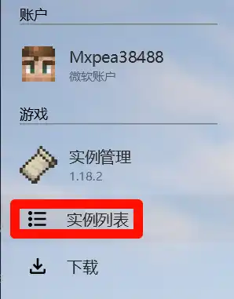

3.点击安装整合包

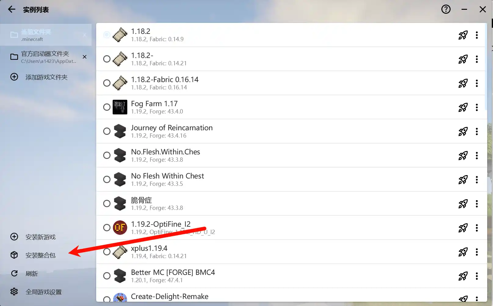

4.点击导入本地整合包
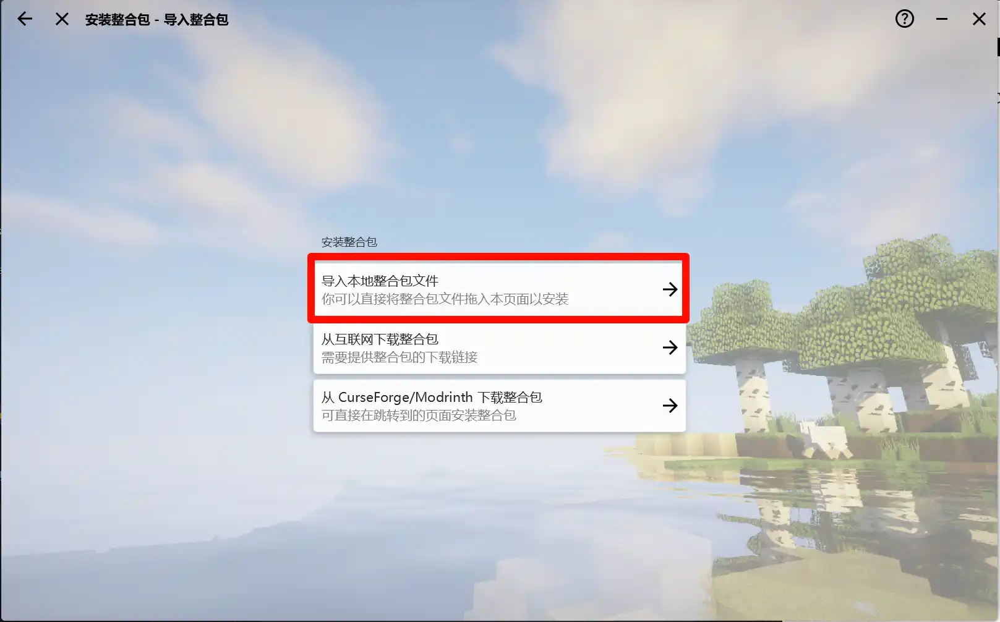

5.找到你下载的整合包文件(一般是在你的下载文件夹)
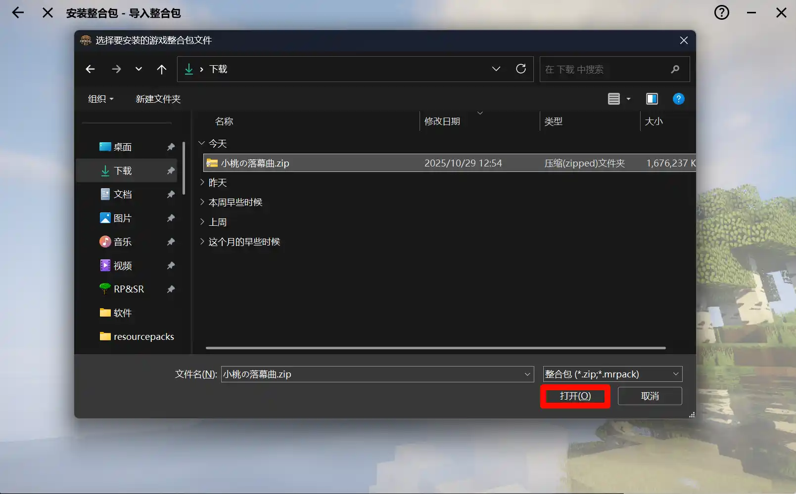

6.检查确认无误后点击安装，等待安装完成

7.在主页菜单中选择到你刚才安装的整合包，点击启动游戏即可
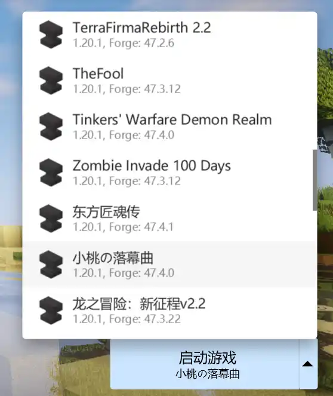

- 为什么使用HMCL作为例子？

- 因为使用PCL2在启动一部分整合包时可能会出现启动失败的问题，同时，HMCL支持的系统更加广泛。

- 另，这是PCL2启动器的整合包安装位置
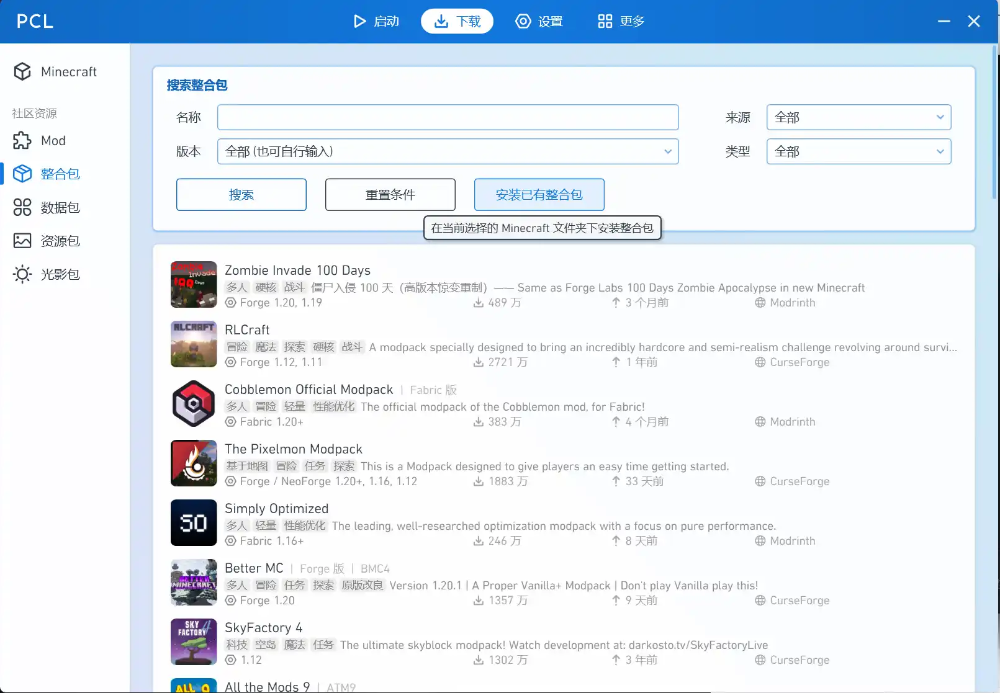

## 进入服务器

- 注：因整合包不同，此部分涉及的部分按钮可能在名称，位置，大小等方面略有不同(~~Fancymenu立大功~~)此处为消歧义，使用原版GUI。

1.点击多人游戏
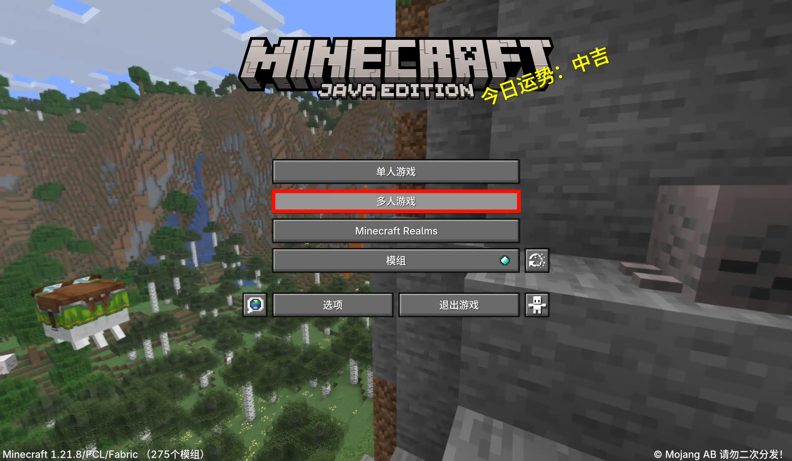

2.点击添加服务器
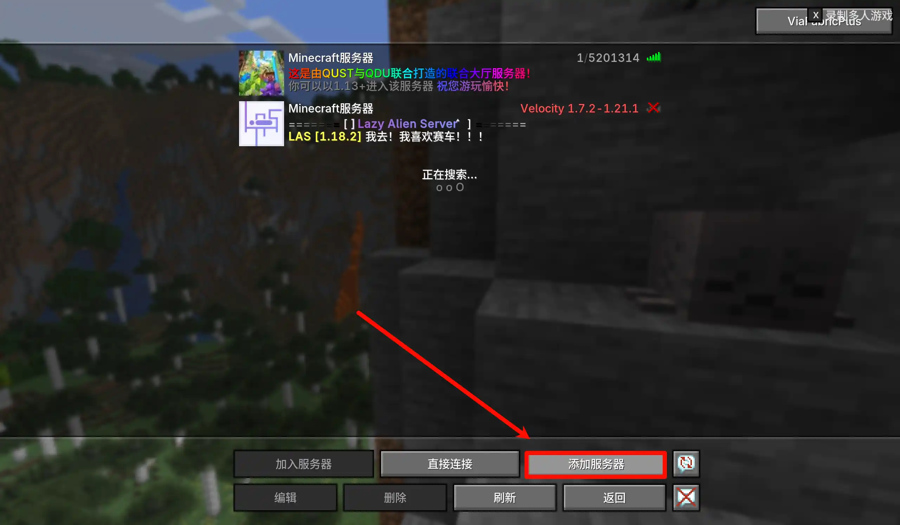

3.在这里填入服务器地址，服务器名称可随意填(请自行在群中寻找)
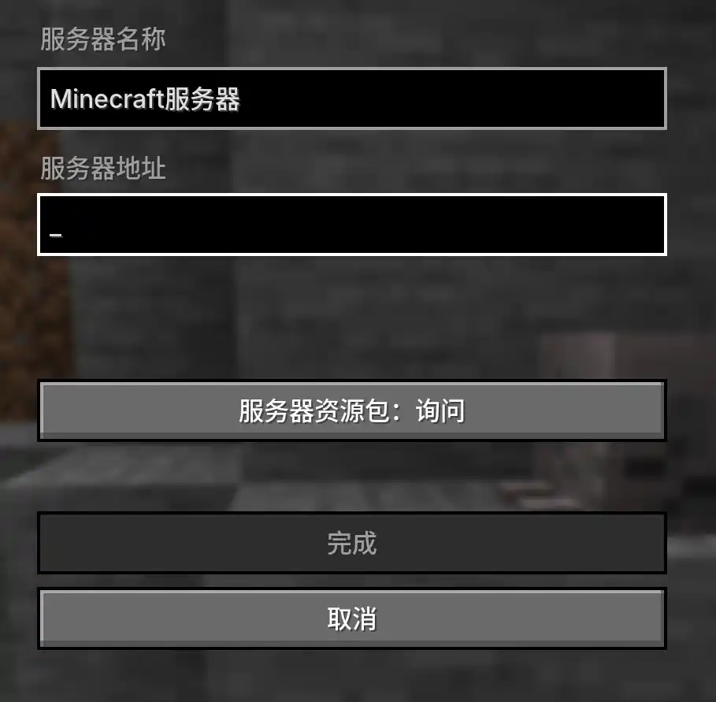

## 出现崩溃

在出现崩溃时，请确保按照以下方法操作：

- 导出错误报告，若你未及时导出就请自行找到游戏版本文件夹下的crash-reports文件夹时间正确的crash文件与logs文件夹下的latest.log(这里我使用了F3+C触发了崩溃)
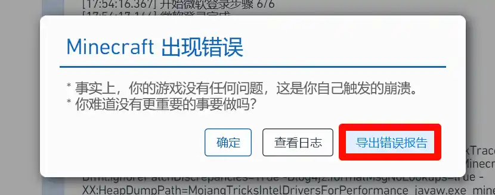

- 将这两个文件上传至[mclo.gs](https://mclo.gs/)并点击“save”
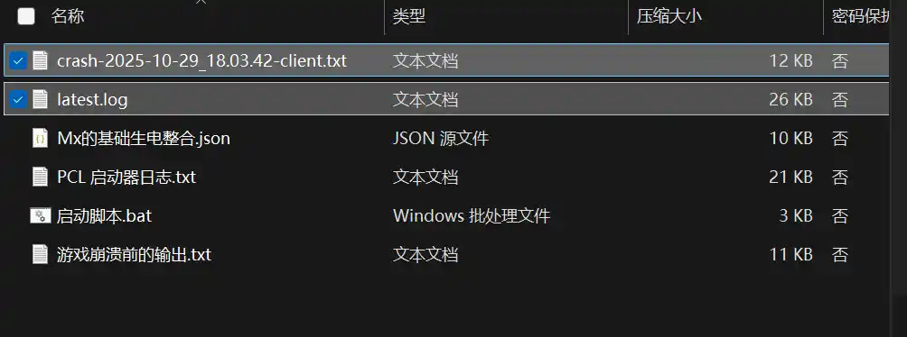

- 完成之后复制链接（两个文件就要上传两次，共两个链接）QQ私信发给我（中德Aure）或是寻求他人帮助。
