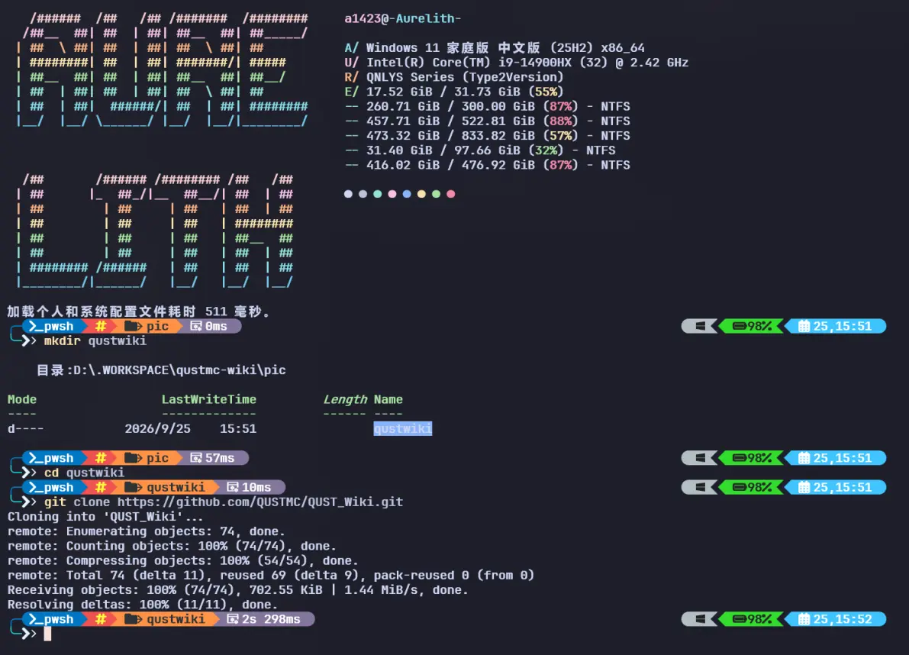
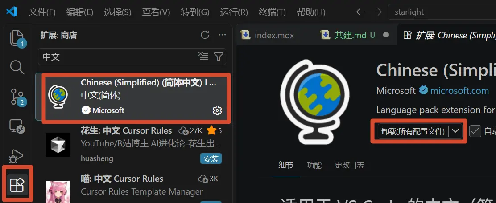
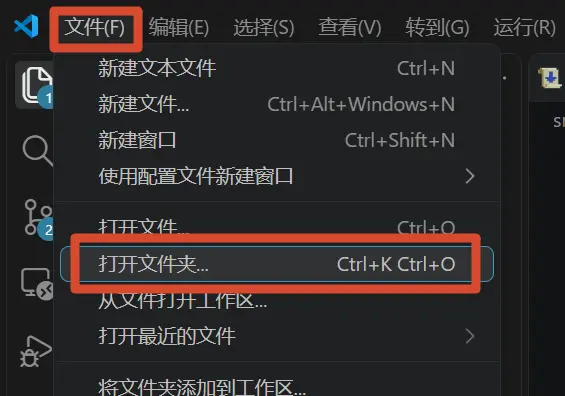
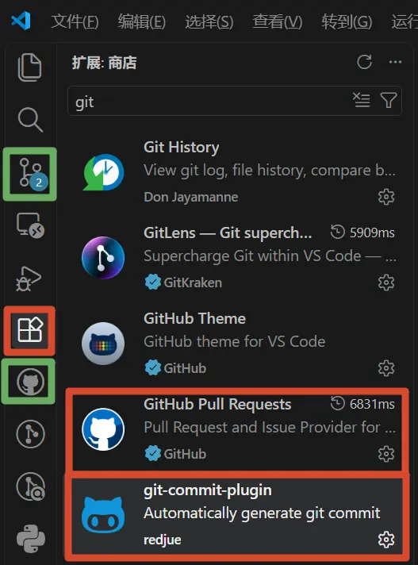
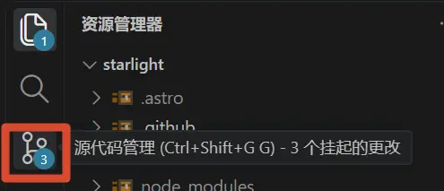
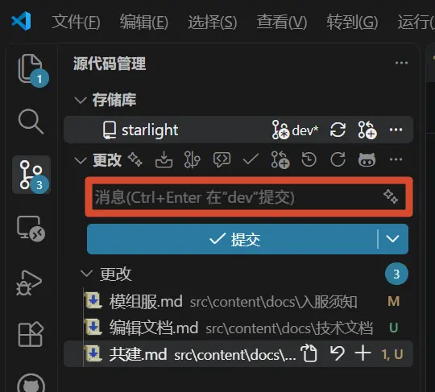
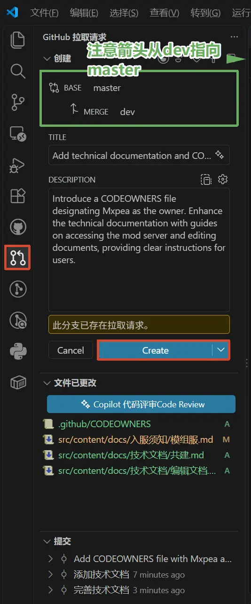

## 1. 拉取源代码

1. 安装 [Git](https://git-scm.com/)。

    克隆仓库：\
    在你所希望存放该项目的文件夹执行以下

    ```pwsh
    mkdir qustwiki
    cd qustwiki
    git clone https://github.com/QUSTMC/Wiki.git
    ```

    

2. 切换到 `dev` 分支。

    :::danger
    必须进行这一步，否则你的改动可能无法正常上传。
    :::

    ```pwsh
    git switch dev
    ```

## 2. 进入编辑

1. 安装 [VS Code](https://code.visualstudio.com/)。

2. 将 VS Code 切换为中文。

    点击安装中文语言包。

    

3. 打开 Git 刚刚生成的文件夹，开始编辑。

    

    详细编辑教程请参阅[编辑文档](../编辑文档)。

## 3. 本地浏览器预览

1. 安装 Git 插件。

    安装完成后，VS Code 中应该会出现绿色标记处的图标。

    

2. 登录你的 GitHub 账号，并确保你拥有仓库的编辑权限。你可以联系 Aure 获取编辑权限。

3. 安装 [NVS](https://github.com/jasongin/nvs/releases)。

4. 安装 Node.js。

    :::note
    在 VS Code 中按 `Ctrl+`` ` `` `（键盘左上角的`~` 键）打开终端。
    :::

   ```pwsh
   nvs add lts
   ```

    之后运行以下命令：

   ```pwsh
   nvs
   ```

    手动选择需要使用的版本即可。

5. 打开开发服务器：

    ```pwsh
    npm run dev
    ```

    之后在浏览器中访问 `http://localhost:4321/`。你在 VS Code 中保存的改动会自动同步到浏览器。

## 4. 提交 PR，等待同步

:::note
这是你做的改动上线的最后一步，请确认改动没有问题。
:::

1. 点击“源代码管理”。

    

2. 在“更改”中简要描述你完成的工作，然后点击“提交”和“同步更改”。

    

3. 点击“创建拉取请求（PR）”并创建请求。审核通过后，稍等片刻即可在网站中看到你贡献的文档。

    

    :::note
    如果审核迟迟没有通过，可以联系 Aure 催审。
    :::
