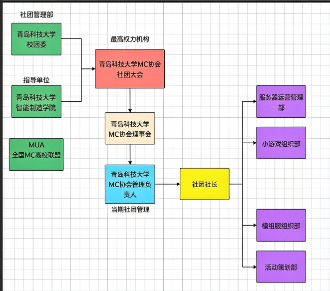

## **欢迎来到QUSTMC文档站！**

## 关于我们

&emsp;   青岛科技大学Minecraft协会，成立于2022年4月25日，是以Minecraft为核心开展同好活动的校级社团。
   社团活动主要通过线上方式进行，平台搭建在实体服务器上。目前已成功开办常驻生存服六个周目，小游戏服务器与mod轮换服务器数余次
   截止2026年10月已有来自四个校区1100余名成员，已加入Minecraft高校联盟（MUA）。

## 社团组成

| 组成类别 | 介绍 |
| ------ | ------ |
| 普通成员 | 参与青岛科技大学MC协会的成员/玩家，不隶属于任何部门。 |
| 干事 | 青岛科技大学MC协会各职能部门成员，隶属于社团管理部门，负责各类社团内事务。 |
| 社长 | 青岛科技大学MC协会的最高管理人员，负责各部门的管理和组织间事务。 |
| 名誉职称 | 特殊表彰、感谢付出而设立。 |  

&emsp;

## 部门简介

|部门名|介绍|
|------|------|
|青岛科技大学校团委|青岛科技大学总社团负责部门。|
|指导单位|与社团指导老师为同单位，负责社团总体走向。|
|青岛科技大学 MC 协会社团大会|社团最高权力机构，负责社团重要具体走向。|
|青岛科技大学 MC 协会理事会|社团决策与监督机构。|
|青岛科技大学 MC 协会管理负责人（当期社团管理）|执行与管理机构。|
|社团负责人（当届社团管理）|负责人组成：社团社长 1 名，下设 若干名分管负责人管理职能部门。|

## 职能部门设置
服务器运营管理部
小游戏组织部
财务管理部
模组服组织部
活动策划部|

## 附属服务器

青岛科技大学服务器 是 青岛科技大学MC协会 运营的多人服务器，服务器为海内外全部科大校友免费开放。
搭建服务器及持续运转需要庞大的经费支持，青岛科技大学MC协会接受任何合规的经济援助，详情请联系财务负责人或社长。

### 生存服

  QUSTMC将在每届开启全新原版生存周目

### Mod服

  Mod服每月一次到两次，会根据大家的投票选出即将要玩的整合包

### 小游戏大厅服

  常驻，小游戏大厅包含bingo/蛋糕塔等小游戏可随时供成员游玩

 ### 小游戏服 
小游戏每月开展三次到四次，会根据大家意愿，参与度开展小游戏

 ### 四方校区复原服
 长期招募有能力有意愿完成四方校区像素化的能人志士

 ### 史料馆
 存放QUSTMC自筹划以来各重要历史节点以及各届趣事

## 企划

**《青岛科技大学四校区复原计划》**  

&emsp;青岛科技大学四校区复原计划立项于2022年7月，暂未结束，是青岛科技大学MC协会以Minecraft为载体对青岛科技大学进行的精确复原地图。项目分为四期工程，即崂山校区复原、四方校区复原、高密校区复原、中德校区复原（排名无先后），是青岛科技大学MC协会目前最大的Minecraft工程，也是目前青岛科技大学所拥有的最为直观生动的GIS工程。

**《像素科大·导览系统》**  

&emsp;由于青岛科技大学包含众多校区，学校规模庞大，而新生录取通知书上的地图在直观性和尺度上都无法正常体现科大的规模。 所以青岛科技大学MC协会正在利用《青岛科技大学四校区复原计划》本身便极为精确生动的特点，尝试与学校各校区合作，为青岛科技大学提供一个全新的导览系统。 青岛科技大学MC协会也希望本图能够印刷进下一批录取通知书，为新生提供直观的引导。

**《QUSTMC·史料馆》**  
&emsp;采用mc参观的创新形式，开展协会历史图文馆沉浸式参观学习活动，以图文资料、发展沿革介绍、经典事迹展示等方式，系统梳理并完整介绍社团从创立到发展至今的成长轨迹、重大发展节点、特色活动积淀与精神文化内核。
